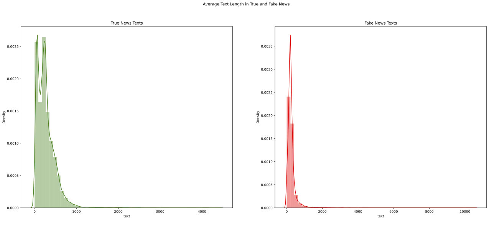
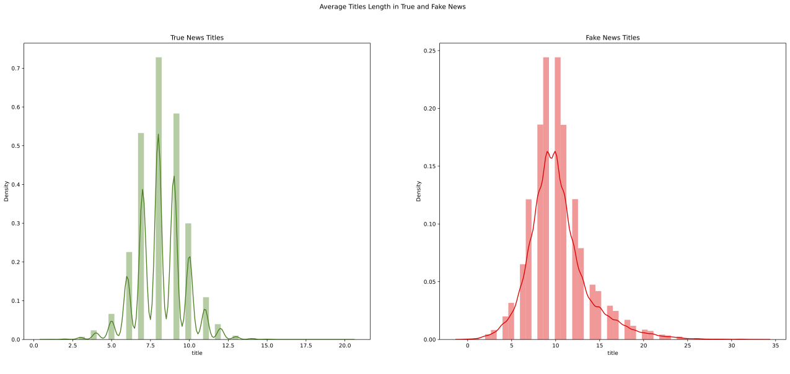

# Fake News Detector

## Project Overview

* I used 4 different machine learning models along with 2 different word embeddings techniques to analyze a news and tell if it's likely to be fake or real
* I combined 2 different databases to avoid information leak and expose the models to different styles of writing 
* I cleaned and processed the data
* I used PassiveAggressive Classifier and Naive Bayes Classifier with the TF-IDF vectorizer, and Support Vector Machines and Neural Network with GloVe
* I created a simple [Flask API](https://app-fake-news-detector.herokuapp.com/) inside Docker and deployed on Heroku that allows to make predictions with the model, and then built a [React application](https://cgmuro.github.io/fake-news-detector-app-frontend/) that connects with the API

---
<br>

## Data

I used two different datasets from Kaggle:
* https://www.kaggle.com/clmentbisaillon/fake-and-real-news-dataset
* https://www.kaggle.com/hassanamin/textdb3

I decided to do so after reading this [Kaggle notebook](https://www.kaggle.com/mosewintner/5-information-leaks-100-accuracy), in which it is explained all the information leaks that are present inside the first dataset, so to avoid the pattern inside that could be inside the way the news were written I decided to merge two different datasets.

---
<br>

## Data Cleaning and Text Processing

I first cleaned the datasets from the information leaks and any other flaw.
And then I did some text processing: removed URLs, tokenized, removed stopwords and punctuation.

---
<br>

## Analysis and Visualization

I analyzed and made graphs of some of the characteristics of both fake and real news, and how they related to each other.
I followed this process with both the title and text.

For example, I analyzed the average lengths:
<br>




Another analysis I did is the most common words:
- Most common words in **fake news** texts:    
        - <em>Trump:</em> 69587,   
        - <em>said:</em> 26731,  
        - <em>people:</em> 24615,  
        - <em>would:</em> 22713,  
        - <em>one:</em> 19713,  
        - <em>Clinton:</em> 19026,  
        - <em>Donald:</em> 16656,  
        - <em>like:</em> 16436,  
        - <em>“:</em> 15535,  
        - <em>”:</em> 15167  
- Most com<em>mon words in **true news** texts:
        - <em>said:</em> 113046,    
        - <em>“:</em> 72324,    
        - <em>”:</em> 71807,    
        - <em>Trump:</em> 67153,    
        - <em>would:</em> 38388,    
        - <em>U.S.:</em> 37863,    
        - <em>also:</em> 20109,    
        - <em>Clinton:</em> 19756,    
        - <em>people:</em> 19714,    
        - <em>Republican:</em> 19514  

---
<br>

## Models

Built different modules and used multiple ways to process text because I wanted to try and practice different techniques.

* ### PassiveAggressive Classifier + TF-IDF
The first model is a PassiveAggressive Classifier with TF-IDF Vectorization.  
The accuracy of this model is  95.7% and it's saved in the folder called ```models``` under the name of ```pa_classifier.pkl```.

* ### Naive Bayes Classifier + TF-IDF
The second model is a Naive Bayes Classifier also with TF-IDF Vectorization.  
The accuracy of this model is  89% and it's saved in the folder called ```models``` under the name of ```naive_bayes.pkl```.

* ### Support Vector Machines Classifier + GloVe
The third model is a Support Vector Machines Classifier that uses the words embeddings method called [GloVe](https://github.com/stanfordnlp/GloVe).   
The accuracy of this model is  91% and it's saved in the folder called ```models``` under the name of ```svm.pkl```.

* ### Neural Network + GloVe
The fourth model is a Neural Network that uses the words embeddings method called [GloVe](https://github.com/stanfordnlp/GloVe).     
This is the architecture of the network with which I got the best results:

```
model = Sequential()

# Embedding layer
model.add(Embedding( max_features, output_dim=embed_size, weights=[embedding_matrix], input_length=maxlen, trainable=False ))

# LSTM layer
model.add(LSTM(units=embed_size, dropout=0.5))
# Dense layer
model.add(Dense(12, activation='relu'))
# Output layer
model.add(Dense(1, activation='sigmoid'))
```

Accuracy: 0.8143631219863892    
Loss: 0.46495574712753296

It's saved in the folder called ```models``` under the name of ```nn.h5```.

---
<br>

## Deployment

After finalizing the **SVM model**, I created a simple Flask API around it, that allows applications to use the model.   
I used Docker to wrap the application and then deployed it to Heroku at the following address: https://app-fake-news-detector.herokuapp.com/

I then created a simple React application where you can paste the corpus of a news, and the application will communicate the result to the user. Here's the application: 

---

## Packages and Resources
**Python Version:** 3.8     
**Packages:** 
```
pip install pandas
pip install numpy  
pip install matplotlib
pip install seaborn
pip install scikit-learn
pip install tensorflow 
pip install nltk 
pip install flask
```
**Resources and References:**   
* [General understanding of fake news](https://miguelmalvarez.com/2017/03/23/how-can-machine-learning-and-ai-help-solving-the-fake-news-problem/)
* [For the first two models](https://medium.com/swlh/detecting-fake-news-with-python-and-machine-learning-f78421d29a06)
* [For a better understanding of how to implement GloVe](https://www.kaggle.com/eswarbabu88/toxic-comment-glove-logistic-regression)
* [General guide](https://www.kaggle.com/madz2000/nlp-using-glove-embeddings-99-87-accuracy)
* [For deploying the Flask API with Docker](https://towardsdatascience.com/simple-way-to-deploy-machine-learning-models-to-cloud-fd58b771fdcf)
